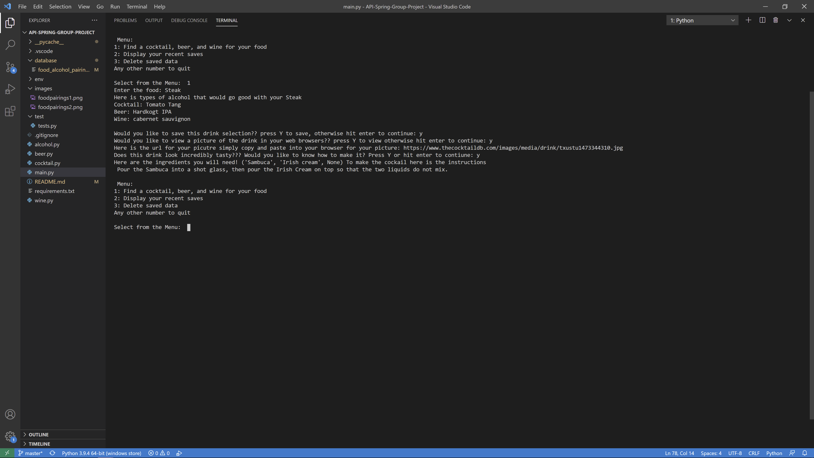
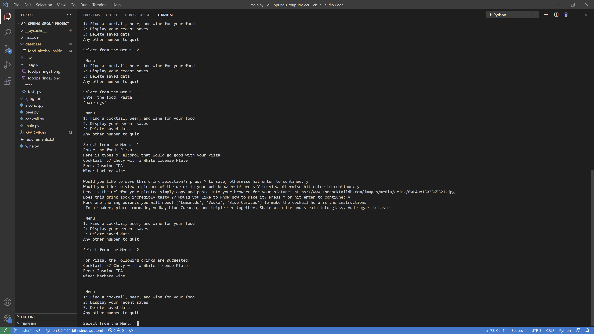

<h1>Food Alcohol Pairing</h1>

This program will pair 3 alcoholic drinks for a specific food the user enters

The program will contact 3 different API's to pull different drinks that will pair well with your food of choice,
Please download the required assets in the requirements.txt file
You can save pairings that you want with your food of choice in a database, and you can delete food of choice in the database.
It uses a SQL database, and modules to organize the data accordingly, any questions message the slack channel

use pip install requirements to download all the required plug-ins

run on the main.py file

Developer
Aaron [ >:) ]

<h2>Pictures</h2>

